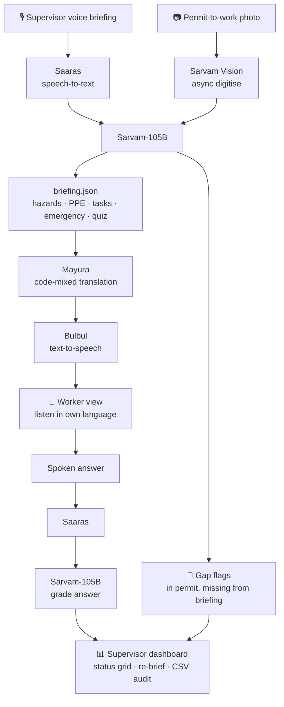

<div align="center">

# 🦺 Site Sabha

**One safety briefing, every worker's language, with proof that each worker understood it.**

[](https://site-sabha.vercel.app/)
[](https://site-sabha.streamlit.app/)
[](https://www.sarvam.ai/)
[](https://www.python.org/)
[](https://streamlit.io/)

### 🔗 [site-sabha.vercel.app](https://site-sabha.vercel.app/) · [Streamlit version](https://site-sabha.streamlit.app/)

🥈 **2nd place** at *Sarvam is coming to SRMIST*

</div>

---

## Try it

| Page | Link | What to do |
|---|---|---|
| **Brief** (supervisor) | [site-sabha.vercel.app](https://site-sabha.vercel.app/) | Pick the sample briefing and permit, click **Run briefing**, and watch the permit gap flags and per-language audio appear |
| **Worker** | [site-sabha.vercel.app/worker?w=Ravi](https://site-sabha.vercel.app/worker?w=Ravi) | Listen in Tamil, then record an answer or pick a sample answer and click **Check my answer** |
| **Tag board** | [site-sabha.vercel.app/board](https://site-sabha.vercel.app/board) | See each worker's scaffold tag turn green, yellow or red, and download the audit CSV |

Turn on **Demo data** in the header to replay a pre-recorded run instantly without calling Sarvam.

---

## Sarvam AI stack

Site Sabha is built on five Sarvam AI models, each covering one step of the pipeline.

| Sarvam product | Model / API | Purpose in Site Sabha |
|---|---|---|
| **Saaras** | `saaras:v4` · Speech-to-Text (`codemix` / `transcribe` modes) | Transcribes the supervisor's spoken briefing (Hindi + English code-mixed) and each worker's spoken answer in their own language. Safety terms are passed as `keyterms` to improve recognition. |
| **Sarvam Vision** | Document Intelligence · `doc_ai.digitise` (async job, Markdown output) | Reads the photographed permit-to-work sheet so its hazards and controls can be checked against the briefing. |
| **Sarvam-105B** | `sarvam-105b` · Chat Completions with strict JSON schema | Structures the briefing into hazards, PPE, tasks, emergency info and quiz questions; flags permit hazards the supervisor missed; grades each worker's answer as *understood*, *partial* or *not understood*. |
| **Mayura** (Sarvam Translate) | `mayura:v1` · `code-mixed` mode | Translates the checklist and quiz into each worker's language while keeping safety terms such as *harness*, *scaffold* and *fire extinguisher* in English, the way crews actually speak. |
| **Bulbul** | `bulbul:v3` · Text-to-Speech | Generates the spoken briefing and quiz question in each worker's language. |

---

## The problem

Construction and factory crews in India are largely migrant workers who speak Odia, Bengali, Hindi, Tamil, Telugu and other languages. The morning safety briefing (the *toolbox talk*) is usually given once, in one language. Workers who don't follow it miss hazard warnings, PPE instructions and emergency procedures.

The only record is a signature on an attendance sheet. That signature proves the worker was present, **not that they understood anything**.

## The solution

The supervisor speaks the briefing once and photographs the day's permit-to-work. Site Sabha then:

1. **Structures** the briefing into hazards, PPE, crew tasks and emergency information.
2. **Checks for gaps** by flagging hazards listed on the permit that the supervisor did not mention.
3. **Localises** it, so every worker hears an audio version in their own language.
4. **Verifies understanding** by asking each worker one question and grading their spoken answer.

The supervisor gets a live dashboard and an exportable audit log.

## Features

| Feature | Why it matters |
|---|---|
| 🚩 **Permit gap check** | Catches hazards the supervisor forgot to mention before work starts |
| 🎙️ **Voice comprehension check** | Replaces "samajh gaya" with evidence that the worker understood |
| 🌐 **Per-worker language** | Every worker hears the briefing in their own language, not the supervisor's |
| 🏷️ **Source-tagged items** | Every checklist item is tagged `briefing` or `permit`, so nothing is invented |
| 📊 **Live dashboard** | Roster × status grid (understood / partial / re-brief / heard / absent) with one-click re-brief |
| 📄 **Audit log** | CSV export a safety officer can use as a compliance record |
| ⚡ **Demo mode** | Replays every Sarvam call from a local cache, so the demo works even without network |

---

## Architecture



**Pipeline notes**

- The Vision job starts as soon as the permit is uploaded and runs in a background thread while Saaras transcribes, since digitisation is the slowest step.
- Saaras's real-time REST API accepts up to 30 seconds of audio, so longer briefings are split into 25-second chunks with ffmpeg and the transcripts joined.
- Every Sarvam call goes through a disk cache keyed by a hash of its inputs. With **Demo mode** on, the app serves only from this cache.

---

## Tech stack

| Layer | Technology |
|---|---|
| AI models | Sarvam AI: Saaras, Sarvam Vision, Sarvam-105B, Mayura, Bulbul |
| SDK | [`sarvamai`](https://pypi.org/project/sarvamai/) Python SDK |
| Web app | [Next.js 16](https://nextjs.org/) (App Router, TypeScript, Tailwind CSS v4) in [`web/`](web/): browser-side audio decoding and chunking with the Web Audio API, API routes for each pipeline step |
| Prototype | [Streamlit](https://streamlit.io/): multipage navigation, `st.audio_input` for in-browser mic recording, auto-refreshing fragments for the live dashboard |
| Backend | Python 3.11 |
| Storage | Vercel Blob (web app) · SQLite (Streamlit) · JSON glossary and roster |
| Audio processing | ffmpeg / ffprobe (normalising, chunking, noise mixing) · Python `wave` (joining TTS clips) |
| Data handling | pandas (dashboard tables) · Pillow (sample permit generation) · requests (Vision result download) |
| Config | python-dotenv locally · Streamlit secrets in the cloud |
| Hosting | [Vercel](https://vercel.com/) (web app) · [Streamlit Community Cloud](https://streamlit.io/cloud) (prototype) |

---

## App walkthrough

**1. Supervisor**: record, upload or pick a sample briefing, add the permit photo, and click **Run Site Sabha**. The page shows:
- red gap flags for permit hazards missing from the briefing
- the hazard and control table, each row tagged 🗣 *briefing* or 📄 *permit*
- PPE, crew tasks, emergency info and the comprehension questions
- a playable audio briefing for every language on the roster

**2. Worker** (`/worker?worker=Ravi`): the worker listens to the briefing in their language, hears one question, and answers by voice. The answer is transcribed and graded:

| Verdict | Meaning |
|---|---|
| ✅ Understood | The answer contains the key safety point |
| ⚠️ Partial | On topic but vague or missing the key condition |
| ❌ Not understood | Wrong, unrelated or no answer, so the worker is flagged for re-brief |

**3. Dashboard**: live status for every worker, a **Re-brief** button for anyone who didn't understand, and a one-click **audit CSV** export.

---

## Project structure

```
site-sabha/
├── web/                    # Next.js web app (Vercel): Brief, Worker, Tag board + API routes
├── app.py                  # Streamlit app: Supervisor, Worker and Dashboard pages
├── pipeline/
│   ├── client.py           # Sarvam client, disk cache, demo mode
│   ├── stt.py              # Saaras speech-to-text with 30 s chunking
│   ├── vision.py           # Sarvam Vision digitise, poll and download
│   ├── llm.py              # Sarvam-105B: structure, gap check, grade (JSON schema)
│   ├── localise.py         # Mayura translation + Bulbul text-to-speech
│   ├── run.py              # End-to-end briefing and answer-check orchestration
│   └── db.py               # SQLite: briefings, acknowledgements, status grid, CSV export
├── prompts/
│   ├── structure.txt       # Briefing → briefing.json
│   ├── gap_check.txt       # Permit vs briefing gap detection
│   └── grade.txt           # Worker answer grading
├── data/
│   ├── roster.csv          # Worker name, language code, phone
│   ├── glossary.json       # Safety terms kept in English
│   ├── sample_briefing.wav # Hindi supervisor briefing (~50 s)
│   ├── noisy_briefing.wav  # Same briefing with site-like noise
│   ├── sample_permit.jpg   # Permit-to-work photo
│   ├── answers/            # Sample worker answers (Tamil, Bengali, Odia)
│   └── cache/              # Cached Sarvam responses for demo mode
├── scripts/
│   ├── make_assets.py      # Generates the sample permit, briefing and answers
│   ├── export_demo.py      # Exports cached results as demo fixtures for web/
│   ├── probe_api.py        # One live call per Sarvam product
│   └── smoke.py            # Headless end-to-end test
├── packages.txt            # System packages for Streamlit Cloud (ffmpeg)
└── requirements.txt
```

---

## Getting started

**Prerequisites:** Python 3.10+, `ffmpeg` on your PATH, and a [Sarvam AI API key](https://dashboard.sarvam.ai/).

```bash
git clone https://github.com/hemish22/site-sabha.git
cd site-sabha
python -m venv .venv
source .venv/bin/activate
pip install -r requirements.txt
cp .env.example .env        # then set SARVAM_API_KEY in .env
```

Run the app:

```bash
streamlit run app.py
```

Optional scripts:

```bash
python scripts/probe_api.py     # check your key against each Sarvam product
python scripts/make_assets.py   # regenerate the sample permit, briefing and answers
python scripts/smoke.py         # end-to-end test; also warms the demo cache
```

The smoke test checks that the briefing is transcribed and structured, the fire-extinguisher gap is flagged, audio is produced for every roster language, and the three sample answers are graded *understood*, *partial* and *not understood*.

### Web app (Next.js on Vercel)

See [web/README.md](web/README.md). Set `SARVAM_API_KEY` on the Vercel project and connect a Vercel Blob store.

### Deploying to Streamlit Community Cloud

1. Fork this repo and create a new app with main file `app.py` and Python 3.11.
2. Under **Advanced settings → Secrets**, add:
   ```toml
   SARVAM_API_KEY = "your-key"
   ```
3. `packages.txt` installs ffmpeg automatically.

---

## Design decisions

- **Code-mixed translation.** Standard translation rendered *harness* in Bengali as the word for a horse's harness. Mayura's `code-mixed` mode keeps safety terms in English, which is how workers actually hear them on site.
- **Reasoning off for Sarvam-105B.** With reasoning enabled, the structuring prompt spent its whole token budget thinking and returned no answer. With it off, responses arrive in about 5 seconds and always match the JSON schema.
- **Grounded output.** The prompts only allow facts found in the briefing or permit, every hazard carries a required `source` tag, and quiz questions come only from what the supervisor actually said.
- **Cache-first reliability.** Every model call is cached by input hash, so repeated runs are fast and the demo keeps working if the network drops.

## Roadmap

- Outbound IVR calls for workers without smartphones (Bulbul audio over the phone, Saaras for the answer)
- WhatsApp delivery of the audio briefing and quiz
- Feeding yesterday's near-miss reports into today's briefing
- Weekly analytics on which hazards are most often misunderstood, and by which crew
- Integration with site ERP and permit-to-work systems

---

## Acknowledgements

🥈 Won **2nd place** at **Sarvam is coming to SRMIST** (26 September 2026, SRMIST Chennai), hosted by **FOSS Club SRM-KTR** and **IEEE Computer Society SRM** with the **[Sarvam AI](https://www.sarvam.ai/)** team.

Full product spec: [SITE_SABHA.md](SITE_SABHA.md)
